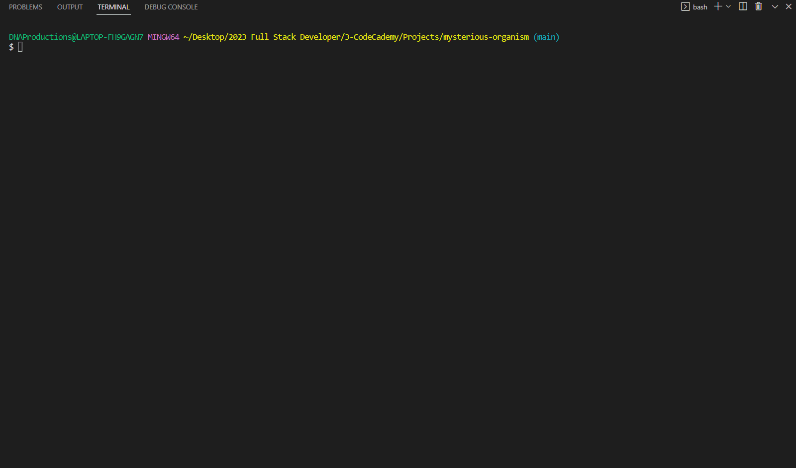

# Studying the Mysterious Organism: P. Aequor
Challenge project to create objects that simulate the DNA of P. aequor for research team to study

## Code Demo
<kbd></kbd>

## Instructions
* this code demo uses Node.js
* ran via terminal through command `node main.js` 

## Features
* includes factory function pAequorFactory(`specimenNum, dna`) that produces `pAequorObj`s
* objects created via pAequorFactory include:
    * mutate()
    * compareDNA(`anotherPAequorObj`)
    * willLikelySurvive()
    * EXTENSION CHALLENGE: complementStrand()
* helper function:
    * createSurvivals(`num`) 
        * takes in a number of specimens required
        * creates an array of surviving pAequor specimens
* extension challenges completed by creating new function:
    * mostRelated(`dnaStrandArr`)
        * takes in an array of `pAequorObj`s
        * returns the specimen numbers and percentage of mostly related survivors
        * for a full print out report, un-comment the comment block in the hardcode function
* all functions tested and passed